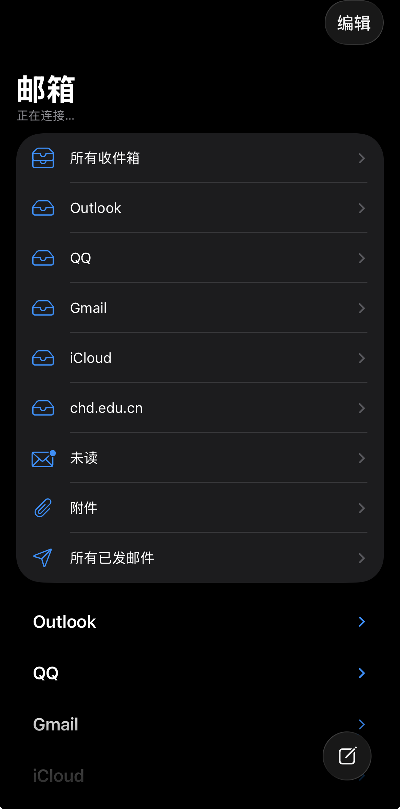
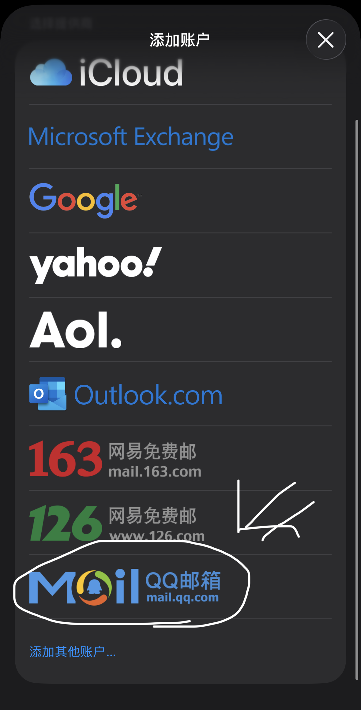

# 如何绑定你的邮箱在像apple mail中集合一样

## QQ邮箱
这是大家最常用的邮箱  
但QQ邮箱的IMAP通信一般不会自动开放  
所以你需要在QQ邮箱中进行一些设置来把这个密码选项打开  
-----
登录mail.qq.com  
输入自己的QQ邮箱的账号和密码  
进入详细设置，找到IMAP通信，打开它  
系统会提示你这会有风险，但我不管，谁会愿意忍受QQ邮箱那抽象而麻烦的页面  
ok，接下来就是打开apple mail，我以我的手机作为演示（型号：iphone 15    系统：IOS 26）  
  
电子邮件填你自己的邮箱 密码填你刚刚在QQ邮箱中得到的授权码（注意不是你的邮箱密码）  
ok 你现在可以用手机自带的邮箱软件来收发消息  
这邮箱最大的优势就是在于简洁（简洁的邮箱发消息也会更舒服，不是吗？）  
---